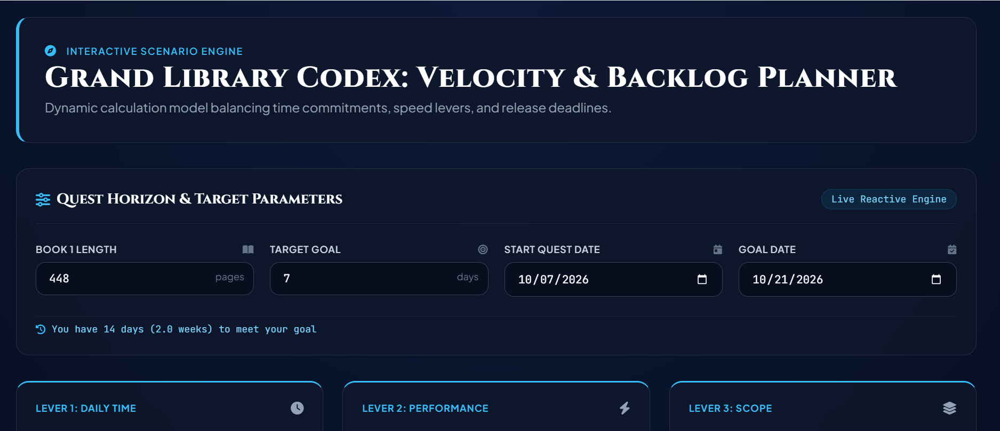

# *Grand Library Codex*

Submitted by: **Amanda Buleu**

This web app is **A reading tracker to meet new book deadlines, and personal reading goals.**

Time spent: **3** hours spent in total

## Features
This offers different charts, and metrics that change as you update the information. I need to finish at least 2 more books to catch up to a new book release, and my deadline is less than 3 weeks away. This tracker offers metrics showing different reading speeds, casual, custom, and the quickest option to meet the goal.

## Video Walkthrough

GIF created with ScreenToGif

## License

    Copyright 2026 Amanda Buleu

    Licensed under the Apache License, Version 2.0 (the "License");
    you may not use this file except in compliance with the License.
    You may obtain a copy of the License at

        http://www.apache.org/licenses/LICENSE-2.0

    Unless required by applicable law or agreed to in writing, software
    distributed under the License is distributed on an "AS IS" BASIS,
    WITHOUT WARRANTIES OR CONDITIONS OF ANY KIND, either express or implied.
    See the License for the specific language governing permissions and
    limitations under the License.